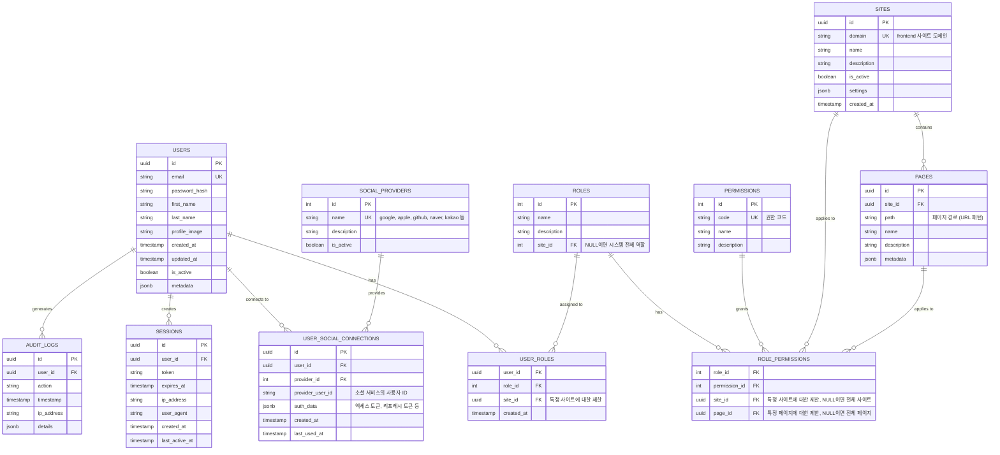

## Database(docker): 구현됨
- postgreSQL

> `.env`

```ini
# Docker 설정
POSTGRES_CONTAINER_NAME=postgres_db
PGADMIN_CONTAINER_NAME=postgres_pgadmin
BASE_IP=1.231.118.217

# PostgreSQL 설정
POSTGRES_USER=admin
POSTGRES_PASSWORD="IlmacPost9)"
POSTGRES_DB=auth_db
POSTGRES_PORT=5433

# 애플리케이션 데이터베이스 URL (Prisma용)
POSTGRES_URL=postgresql://${POSTGRES_USER}:${POSTGRES_PASSWORD}@${BASE_IP}:${POSTGRES_PORT}/${POSTGRES_DB}?schema=public
```

### tables

```sql
\c auth_db;

-- USERS 테이블
CREATE EXTENSION IF NOT EXISTS "uuid-ossp";

CREATE TABLE users (
    id UUID PRIMARY KEY DEFAULT uuid_generate_v4(),
    email VARCHAR(255) UNIQUE NOT NULL,
    password_hash VARCHAR(255),
    first_name VARCHAR(100),
    last_name VARCHAR(100),
    profile_image VARCHAR(255),
    created_at TIMESTAMP WITH TIME ZONE DEFAULT CURRENT_TIMESTAMP,
    updated_at TIMESTAMP WITH TIME ZONE DEFAULT CURRENT_TIMESTAMP,
    is_active BOOLEAN DEFAULT TRUE,
    metadata JSONB
);

-- SOCIAL_PROVIDERS 테이블
CREATE TABLE social_providers (
    id SERIAL PRIMARY KEY,
    name VARCHAR(50) UNIQUE NOT NULL,
    description TEXT,
    is_active BOOLEAN DEFAULT TRUE
);

-- 기본 소셜 제공자 추가
INSERT INTO social_providers (name, description) VALUES
    ('google', 'Google OAuth2 Provider'),
    ('apple', 'Apple Sign In Provider'),
    ('github', 'GitHub OAuth Provider'),
    ('naver', 'Naver Login Provider'),
    ('kakao', 'Kakao Login Provider');

-- USER_SOCIAL_CONNECTIONS 테이블
CREATE TABLE user_social_connections (
    id UUID PRIMARY KEY DEFAULT uuid_generate_v4(),
    user_id UUID NOT NULL REFERENCES users(id) ON DELETE CASCADE,
    provider_id INTEGER NOT NULL REFERENCES social_providers(id) ON DELETE CASCADE,
    provider_user_id VARCHAR(255) NOT NULL,
    auth_data JSONB NOT NULL,
    created_at TIMESTAMP WITH TIME ZONE DEFAULT CURRENT_TIMESTAMP,
    last_used_at TIMESTAMP WITH TIME ZONE,
    UNIQUE (provider_id, provider_user_id)
);

-- SITES 테이블
CREATE TABLE sites (
    id UUID PRIMARY KEY DEFAULT uuid_generate_v4(),
    domain VARCHAR(255) UNIQUE NOT NULL,
    name VARCHAR(100) NOT NULL,
    description TEXT,
    is_active BOOLEAN DEFAULT TRUE,
    settings JSONB,
    created_at TIMESTAMP WITH TIME ZONE DEFAULT CURRENT_TIMESTAMP
);

-- PAGES 테이블
CREATE TABLE pages (
    id UUID PRIMARY KEY DEFAULT uuid_generate_v4(),
    site_id UUID NOT NULL REFERENCES sites(id) ON DELETE CASCADE,
    path VARCHAR(255) NOT NULL,
    name VARCHAR(100) NOT NULL,
    description TEXT,
    metadata JSONB,
    UNIQUE (site_id, path)
);

-- ROLES 테이블
CREATE TABLE roles (
    id SERIAL PRIMARY KEY,
    name VARCHAR(50) NOT NULL,
    description TEXT,
    site_id UUID REFERENCES sites(id) ON DELETE CASCADE,
    UNIQUE (name, site_id)
);

-- 기본 역할 추가
INSERT INTO roles (name, description, site_id) VALUES
    ('admin', '시스템 관리자', NULL),
    ('user', '일반 사용자', NULL);

-- PERMISSIONS 테이블
CREATE TABLE permissions (
    id SERIAL PRIMARY KEY,
    code VARCHAR(50) UNIQUE NOT NULL,
    name VARCHAR(100) NOT NULL,
    description TEXT
);

-- 기본 권한 추가
INSERT INTO permissions (code, name, description) VALUES
    ('READ', '읽기 권한', '페이지 또는 리소스 열람 권한'),
    ('WRITE', '쓰기 권한', '데이터 생성 및 수정 권한'),
    ('DELETE', '삭제 권한', '데이터 삭제 권한'),
    ('ADMIN', '관리자 권한', '관리자 기능 접근 권한');

-- ROLE_PERMISSIONS 테이블
CREATE TABLE role_permissions (
    role_id INTEGER NOT NULL REFERENCES roles(id) ON DELETE CASCADE,
    permission_id INTEGER NOT NULL REFERENCES permissions(id) ON DELETE CASCADE,
    site_id UUID REFERENCES sites(id) ON DELETE CASCADE,
    page_id UUID REFERENCES pages(id) ON DELETE CASCADE,
    PRIMARY KEY (role_id, permission_id, COALESCE(site_id, '00000000-0000-0000-0000-000000000000'::UUID), COALESCE(page_id, '00000000-0000-0000-0000-000000000000'::UUID))
);

-- USER_ROLES 테이블
CREATE TABLE user_roles (
    user_id UUID NOT NULL REFERENCES users(id) ON DELETE CASCADE,
    role_id INTEGER NOT NULL REFERENCES roles(id) ON DELETE CASCADE,
    site_id UUID REFERENCES sites(id) ON DELETE CASCADE,
    created_at TIMESTAMP WITH TIME ZONE DEFAULT CURRENT_TIMESTAMP,
    PRIMARY KEY (user_id, role_id, COALESCE(site_id, '00000000-0000-0000-0000-000000000000'::UUID))
);

-- SESSIONS 테이블
CREATE TABLE sessions (
    id UUID PRIMARY KEY DEFAULT uuid_generate_v4(),
    user_id UUID NOT NULL REFERENCES users(id) ON DELETE CASCADE,
    token VARCHAR(255) UNIQUE NOT NULL,
    expires_at TIMESTAMP WITH TIME ZONE NOT NULL,
    ip_address VARCHAR(45),
    user_agent TEXT,
    created_at TIMESTAMP WITH TIME ZONE DEFAULT CURRENT_TIMESTAMP,
    last_active_at TIMESTAMP WITH TIME ZONE DEFAULT CURRENT_TIMESTAMP
);

-- AUDIT_LOGS 테이블
CREATE TABLE audit_logs (
    id UUID PRIMARY KEY DEFAULT uuid_generate_v4(),
    user_id UUID REFERENCES users(id) ON DELETE SET NULL,
    action VARCHAR(100) NOT NULL,
    timestamp TIMESTAMP WITH TIME ZONE DEFAULT CURRENT_TIMESTAMP,
    ip_address VARCHAR(45),
    details JSONB
);

-- 인덱스 생성
CREATE INDEX idx_user_social_connections_user_id ON user_social_connections(user_id);
CREATE INDEX idx_pages_site_id ON pages(site_id);
CREATE INDEX idx_role_permissions_role_id ON role_permissions(role_id);
CREATE INDEX idx_role_permissions_site_id ON role_permissions(site_id) WHERE site_id IS NOT NULL;
CREATE INDEX idx_role_permissions_page_id ON role_permissions(page_id) WHERE page_id IS NOT NULL;
CREATE INDEX idx_user_roles_user_id ON user_roles(user_id);
CREATE INDEX idx_user_roles_site_id ON user_roles(site_id) WHERE site_id IS NOT NULL;
CREATE INDEX idx_sessions_user_id ON sessions(user_id);
CREATE INDEX idx_sessions_expires_at ON sessions(expires_at);
CREATE INDEX idx_audit_logs_user_id ON audit_logs(user_id);
CREATE INDEX idx_audit_logs_timestamp ON audit_logs(timestamp);

-- 트리거 함수 생성: 사용자 업데이트 시 updated_at 자동 갱신
CREATE OR REPLACE FUNCTION update_updated_at_column()
RETURNS TRIGGER AS $$
BEGIN
    NEW.updated_at = CURRENT_TIMESTAMP;
    RETURN NEW;
END;
$$ LANGUAGE plpgsql;

-- 트리거 적용
CREATE TRIGGER update_users_updated_at
BEFORE UPDATE ON users
FOR EACH ROW
EXECUTE FUNCTION update_updated_at_column();
```

## ER Diagram



## 테이블 설명

1. **USERS**: 사용자 기본 정보
   - 이메일과 비밀번호 기반 인증 정보
   - metadata 필드를 통해 확장 가능한 사용자 정보 저장

2. **SOCIAL_PROVIDERS**: 지원하는 소셜 로그인 제공자 목록
   - Google, Apple, GitHub, Naver, Kakao 등

3. **USER_SOCIAL_CONNECTIONS**: 사용자와 소셜 계정 간의 연결 정보
   - 소셜 서비스의 액세스 토큰, 리프레시 토큰 등 저장

4. **SITES**: 등록된 프론트엔드 사이트 정보
   - 각 사이트별 설정 및 메타데이터

5. **PAGES**: 사이트별 페이지 정보
   - URL 패턴을 통해 페이지 식별

6. **ROLES**: 역할 정보
   - 사이트별 또는 전체 시스템에 적용 가능한 역할

7. **PERMISSIONS**: 권한 정보
   - 예: READ, WRITE, ADMIN 등의 기본 권한

8. **ROLE_PERMISSIONS**: 역할과 권한의 매핑
   - 특정 사이트나 페이지에 제한된 권한 설정 가능

9. **USER_ROLES**: 사용자와 역할의 매핑
   - 사용자에게 특정 사이트에 대한 역할 부여

10. **SESSIONS**: 사용자 세션 관리
    - 토큰 기반 인증 지원
    - 세션 만료 및 활동 추적

11. **AUDIT_LOGS**: 감사 로그
    - 중요 작업에 대한 사용자 활동 기록